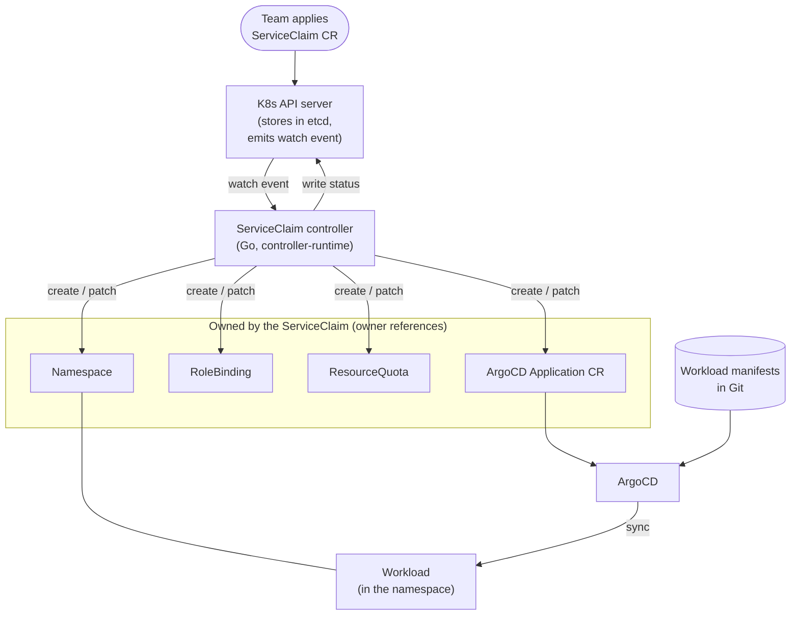

# ADR 005: Custom CRD + Go Controller as Spec Reconciler

- **Status:** Accepted
- **Date:** 2026-05-03
- **Implemented:** yes (the controller, status conditions, idempotent apply, and finalizers are all built)
- **Deciders:** Yu Ting
- **Supersedes:** ADR-004 (Argo Workflows as reconciler)
- **Amended by:** ADR-007 (drops Argo Workflows/Events from the design; the Phase 2 mentions in this ADR are no longer current)
- **Related:** ADR-000 (Argo ecosystem)

## Context

ADR-004 chose Argo Workflows as the spec reconciler for MVP speed. The
reasoning was sound within its stated constraint: ship a working
end-to-end demo in 1-2 weeks without learning a new control plane.

After the foundation day, the project's core purpose was reassessed.
idp-platform-lab is not a time-boxed demo — its purpose is to build real platform
engineering depth. The question became:
**what is the skill gap most worth crossing?**

The answer is unambiguous: **controller/CRD/reconcile-loop**. This is
the foundational pattern behind every production platform tool —
Crossplane, Cluster API, ArgoCD itself, and every "batteries-included"
Kubernetes operator. A platform engineer who can't write and explain
a controller has a visible gap.

Using Argo Workflows as the reconciler bypassed this skill entirely.
The ADR-004 rationale — "the Workflow steps map 1:1 to operator reconcile
steps, so the migration is straightforward" — is aspirational. You cannot
make that claim credibly until you've written the operator. The
"reversible migration" narrative was doing load-bearing work it hadn't
earned.

## Decision

Use a **custom CRD + Go controller** (kubebuilder / controller-runtime)
as the spec reconciler. `ServiceClaim` becomes a real Kubernetes CRD with:
- OpenAPI schema validation (rejects malformed specs at `kubectl apply`)
- Status subresource (controller writes reconcile state back onto the CR)
- Finalizers (controlled teardown of owned resources)

The controller watches `ServiceClaim` CRs and reconciles them into:
- `Namespace` (team isolation)
- `RoleBinding` (RBAC for the team's service account)
- `ResourceQuota` (compute/memory limits per spec)
- `ArgoCD Application` CR (delegates workload sync to ArgoCD)

ArgoCD continues to handle workload Git-to-cluster sync for the namespace
the controller created. Argo Workflows is **not the reconciler** — it
returns in Phase 2 as a delegated task runner for finite, potentially
long-running jobs such as image builds and scheduled maintenance.

Argo Events is **removed from the core reconcile path**. The Kubernetes
API server's watch mechanism (via controller-runtime's informer/cache)
replaces Git polling as the trigger for reconciliation.

This decision supersedes ADR-004.

## Architecture

The diagram shows the core reconcile path. The team applies one `ServiceClaim`;
the controller does everything else. ArgoCD syncs the workload from Git into the
namespace the controller created.

Argo Workflows and Argo Events are not part of the design (see ADR-007). The
reconcile trigger is the API server's watch mechanism via controller-runtime's
informer, not an external event source.

## Alternatives Considered

### Keep ADR-004 (Argo Workflows as reconciler)

The original choice. Retaining it would allow a faster initial demo but
leave the core skill gap unaddressed.

**Why not kept:**
- The project's stated purpose is building platform engineering depth,
  not shipping the fastest demo.
- "Modular reconcile actions that map 1:1 to operator steps" is an
  assertion that can only be validated by writing the operator. Using
  Workflows instead is circular: the claim supports the choice, and
  the choice prevents validating the claim.
- The question "walk me through your controller's reconcile loop" has
  no honest answer if we used Argo Workflows.
- The "reversible migration" story becomes the actual destination once
  the controller exists; skipping to the destination is strictly better.

### Off-the-shelf self-service platforms

Several existing projects already deliver a `ServiceClaim`-shaped
abstraction — a declarative high-level API that fans out into namespace,
RBAC, and quota. They are real options for solving this problem, and a
production decision would evaluate them seriously:

- **Crossplane** — define a `CompositeResourceDefinition` (the high-level
  API) and a `Composition` (the fan-out into child resources). This is the
  closest analog: it productizes the exact CRD + reconcile pattern idp-platform-lab
  builds by hand.
- **Kratix** — a "platform as a product" framework whose `Promise` lets a
  platform team publish a requestable capability; app teams submit a
  request and the environment is materialized. Maps almost directly onto
  idp-platform-lab's intent.
- **Capsule** — a lightweight multi-tenancy operator whose `Tenant` CR
  manages namespace quotas, RBAC, and network policy. Nearly one-to-one
  with the namespace + RBAC + quota core of `ServiceClaim`.
- **vCluster / Loft** — hand each team a virtual cluster for stronger
  isolation than a shared namespace, with Loft adding self-service and
  governance on top.

**Why not chosen:** all of these would mean *configuring* someone else's
reconciler rather than *authoring* one. The reconcile loop, status
conditions, idempotent server-side apply, finalizer-based teardown, and
owner-reference garbage collection — the mechanics this project exists to
implement and understand — would stay inside a black box. Writing the
controller directly is the point: it builds first-hand fluency in the
pattern that Crossplane, Capsule, and the rest are themselves built on,
which is also what lets you reason about *when* to reach for them and where
their boundaries lie. For a Kubernetes-native isolation use case at this
scale, the dependency and operational surface of a full platform layer
also outweighs its benefit.

## Consequences

### Positive

- **Industry-standard pattern.** Controller-based platform abstraction
  is how Crossplane, Cluster API, cert-manager, and ArgoCD itself are
  built. Learning it means learning the pattern the whole ecosystem shares.

- **Free Kubernetes infrastructure.** By defining a real CRD, the
  project inherits: OpenAPI schema validation, `kubectl` tab-completion
  and explain, RBAC on CR objects, `status` subresource, watch/informer
  push-based updates, owner references for garbage collection, and
  finalizer-based teardown. None of this requires writing extra code.

- **Argo Events removed from core path.** The K8s API server's watch
  mechanism replaces Git polling as the reconcile trigger. Fewer moving
  parts, lower operational surface, simpler mental model.

- **No Git as intermediate storage.** ADR-004's flow committed generated
  manifests back to Git as an intermediate step. The controller applies
  child resources directly, with ArgoCD only receiving the `Application`
  CR pointer. The reconcile chain is shorter and easier to trace.

- **"Reversible migration" story is moot.** ADR-004 framed the Operator
  as a future migration target. We're building it now — the migration
  narrative becomes a description of what happened, not a plan.

- **OTel traces bridge naturally.** A controller emitting OpenTelemetry
  spans per reconcile call (resource created, patched, finalized)
  directly links idp-platform-lab to the otel-platform-lab project.
  Argo Workflow logs don't have the same tracing affordance.
  **Superseded (2026-07-22):** the cross-lab link is dropped. idp-platform-lab
  and otel-platform-lab stay separate labs. The tracing affordance of the
  reconcile pattern still holds; the plan to join the two labs does not. See
  ROADMAP, "Out of scope."

### Negative

- **Higher implementation cost.** Writing a controller requires
  understanding controller-runtime concepts: `Manager`, `Reconciler`,
  `Client`, `Cache`, informers, `Owns`/`Watches`, finalizers, and status
  patching. This is not a weekend task for someone new to the library.

- **Longer MVP timeline.** Estimated 4-6 weeks at 5 hrs/week, compared
  to the original 1-2 week estimate in ADR-004. The timeline is
  acceptable because the project's value is the depth of the
  implementation, not the speed of the first demo.

- **Reconcile loop bugs are subtle.** Infinite reconcile (always
  returning non-nil error), stale cache reads (reading a resource that
  was just written, getting the old version), and missed updates (not
  watching the right object types) are common pitfalls. Mitigation:
  test with envtest, use `controller-runtime`'s built-in rate limiting,
  and document each pitfall as a journal entry.

- **Argo Workflows absent from core demo.** Reduces the visible "Argo
  ecosystem" surface in the initial demo. Mitigated: Workflows returns
  in Phase 2 as the image-build task runner — its correct role
  (finite, parameterized DAGs) rather than an incorrect one
  (a continuous, level-triggered reconciler).
