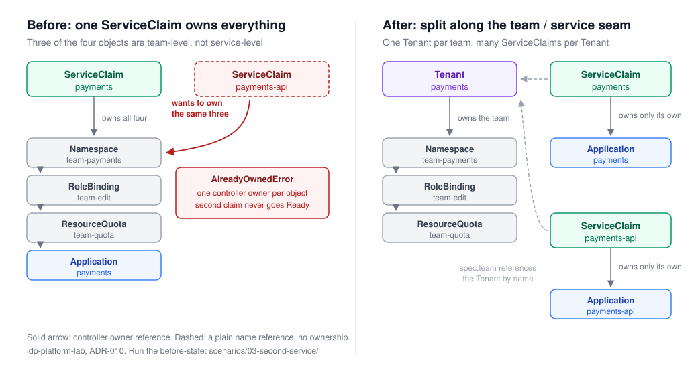

# Scenario 03: the team that wants a second service

> A reconstruction. The code in `before/` was written in 2026-09, not recovered
> from history. Read "Reconstructed, not recovered" below before you quote
> anything from it.

## The situation

"The payments team is onboarding a second service." It sounds like the smallest
possible request, and at M3 it was the request this platform could not serve.

Back then one `ServiceClaim` carried everything: the team's allocation and one
service's workload. Reconciling it created four objects and took ownership of
all four, in this order:

1. the namespace `team-<team>`
2. the RoleBinding `team-edit` in that namespace
3. the ResourceQuota `team-quota` in that namespace
4. an ArgoCD `Application` for the service

The first three are team-level. Only the fourth belongs to one service. So the
team's second claim asks to own three objects that its first claim already owns,
and Kubernetes allows exactly one controller owner per object.



## Run the before-state

You need Docker, `k3d`, `kubectl`, `task` and Go. Everything runs in a cluster
this scenario creates for itself.

```sh
cd before
task up          # creates the k3d cluster idp-03-before, writes ./.kubeconfig
task install     # the M3 CRD, the ArgoCD Application CRD, the argocd namespace
task run         # the reconstructed M3 controller, in the foreground
```

Then, in a second terminal:

```sh
cd before
task repro       # applies one claim, waits for Ready, applies a second claim
task down        # deletes the cluster when you are finished
```

`task up` does not change your current kubectl context, and every other task
refuses to run unless the context is this scenario's own cluster. Nothing here
can reach the cluster your normal `kubectl` talks to.

## What you should see

The first claim, `payments`, reaches `Ready` with five conditions True.

The second claim, `payments-api`, does not. It reports:

- `NamespaceReady=False`, reason `NamespaceError`, with the message
  `Object /team-payments is already owned by another ServiceClaim controller payments`.
  The leading slash is not a typo: a namespace has no namespace of its own, so
  the "namespace/name" pair prints with an empty first half.
- `Ready=False`, reason `ResourcesNotReady`.
- No `RBACReady`, `QuotaApplied` or `ArgoAppCreated` at all. Those conditions are
  missing rather than False, because the reconcile stopped at the first step and
  never reached them.

In the controller's terminal the same reconcile keeps failing and backing off.
The error comes from `controllerutil.SetControllerReference` inside the
`CreateOrUpdate` mutate function, so the second claim never writes anything to
the namespace. It cannot: it is refused before the update.

## Reconstructed, not recovered

The failure was real. It was hit at M3, and ADR-010 was written to fix it. The
code that failed is gone: this repository and the one it grew out of both have
squashed histories, so nothing pre-split was ever committed anywhere you can
check out.

**Faithful, and traceable to a document:** the four steps and their order, the
object names `team-<team>`, `team-edit` and `team-quota`, the group-to-`edit`
RoleBinding and the quota mapping (ADR-008), the unstructured `Application` with
its kustomize image and replica overrides (ADR-009), the claim owning all four
objects, and `spec.resources` living on the claim (ADR-010's Context describes
exactly this shape).

**Choices made today, because the original is unavailable:**

- The controller runs on your machine against the cluster, not as a Deployment
  inside it. Nothing about the ownership conflict depends on where it runs.
- There is no real ArgoCD. Only its `Application` CRD is installed, so the first
  claim can create an `Application` object and reach `Ready`. Nothing syncs, and
  the `ArgoAppCreated` message says "awaiting ArgoCD" instead of reporting live
  health.
- The M3 `Application` carries no ArgoCD cascade finalizer. That finalizer was
  added in M4 (ADR-012), so including it here would show M4 behavior in an M3
  reconstruction.
- If a claim declares no resources, this version skips the quota instead of
  deleting a stale one. The real controller deletes it, but that branch may
  postdate M3, so the simpler behavior is used.
- Log output is plain console lines with stack traces turned off, so a reader
  sees the error instead of a stack trace on every retry.

**What this cannot show:** ADR-010 also notes that two claims would fight over
one `team-quota`, each writing its own `spec.resources` into it. You will not
see that here, and it never happened in practice either. The second claim stops
at step 1, so it never reaches the quota. That argument stands on reading the
code, not on watching it.

## The after-state

The current design splits the object: a `Tenant` owns the namespace, RoleBinding
and quota, and many `ServiceClaim`s reference it and own only their own
`Application`.

- Proven by test: `internal/controller/serviceclaim_controller_test.go`, the spec
  "lets one team run many services: two claims on one Tenant both go Ready".
  Run it with `task test` from the repository root.
- Proven on a cluster: the M3 live walkthrough in
  [docs/verification.md](../../docs/verification.md) under "M3 — ArgoCD
  Application integration", now with a `Tenant` applied first.

## Why it was designed this way

- [ADR-010](../../docs/adr/010-split-tenant-and-serviceclaim.md) splits the CRD,
  and explains the three alternatives it rejected.
- [ADR-007](../../docs/adr/007-extensible-self-service-idp.md) flagged, before
  any second CRD existed, that CR ownership would need deliberate design.
- [ADR-017](../../docs/adr/017-scenario-reconstructions.md) is the rule this
  directory follows.

## The diagram

`ownership-before-after.svg` is the source. Some places (LinkedIn, a few
editors) will not take SVG, so export a PNG when you need one:

```sh
"/Applications/Google Chrome.app/Contents/MacOS/Google Chrome" --headless \
  --screenshot=ownership-before-after.png --window-size=1040,560 \
  --force-device-scale-factor=2 --default-background-color=FFFFFFFF \
  ownership-before-after.svg
```

The PNG is gitignored: it is a build artifact, and the SVG is what gets edited.
